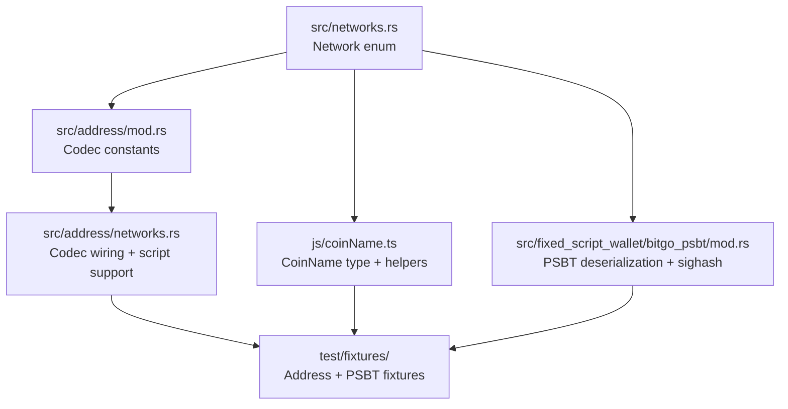

# Adding a New Coin to wasm-utxo

This guide covers adding support for a new UTXO coin to the wasm-utxo library.
wasm-utxo handles low-level PSBT construction, transaction signing, and address
encoding/decoding, compiled from Rust to WASM. It uses **foocoin**
(`foo`/`tfoo`) as a worked example.

## Overview of changes



## 1. Network enum

**File:** `src/networks.rs`

Add two variants to the `Network` enum (mainnet + testnet) and update every
match arm. The Rust compiler will enforce exhaustive matching, so any missed arm
will be a compile error.

### Enum definition

```rust
pub enum Network {
    // ...existing variants...
    Foocoin,
    FoocoinTestnet,
}
```

### Match arms to update

There are 5 match-based functions/arrays that need a new arm. Use the existing
Dogecoin entries as a template for a simple coin.

| Location            | What to add                                                                           |
| ------------------- | ------------------------------------------------------------------------------------- |
| `ALL` array         | `Network::Foocoin, Network::FoocoinTestnet`                                           |
| `as_str()`          | `"Foocoin"`, `"FoocoinTestnet"`                                                       |
| `from_name_exact()` | `"Foocoin" => Some(Network::Foocoin)`, etc.                                           |
| `from_coin_name()`  | `"foo" => Some(Network::Foocoin)`, `"tfoo" => ...`                                    |
| `to_coin_name()`    | `Network::Foocoin => "foo"`, etc.                                                     |
| `mainnet()`         | `Network::Foocoin => Network::Foocoin`, `Network::FoocoinTestnet => Network::Foocoin` |

> **Skip `from_utxolib_name()` / `to_utxolib_name()`** — these exist for
> backwards compatibility with existing coins routed through the deprecated
> utxo-lib. New coins must not be added to these functions.

Also update the test `test_all_networks` assertion count.

## 2. TypeScript coin name

**File:** `js/coinName.ts`

Register the new coin's short names so that the TypeScript layer can reference
them. The `CoinName` type is derived automatically from the `coinNames` tuple.

1. Add `"foo"` and `"tfoo"` to the `coinNames` array.
2. Add a `case "tfoo": return "foo"` arm to `getMainnet()`.

No changes are needed to `isMainnet()` / `isTestnet()` — they delegate to
`getMainnet()`.

## 3. Address codec constants

**File:** `src/address/mod.rs`

Define the Base58Check version bytes for the coin. Find these in the coin's
`chainparams.cpp` under `base58Prefixes[PUBKEY_ADDRESS]` and
`base58Prefixes[SCRIPT_ADDRESS]`.

```rust
// Foocoin
// https://github.com/example/foocoin/blob/master/src/chainparams.cpp
pub const FOOCOIN: Base58CheckCodec = Base58CheckCodec::new(0x3f, 0x41);
pub const FOOCOIN_TEST: Base58CheckCodec = Base58CheckCodec::new(0x6f, 0xc4);
```

If the coin supports SegWit (bech32 addresses), also add:

```rust
pub const FOOCOIN_BECH32: Bech32Codec = Bech32Codec::new("foo");
pub const FOOCOIN_TEST_BECH32: Bech32Codec = Bech32Codec::new("tfoo");
```

If the coin uses CashAddr (like Bitcoin Cash), use `CashAddrCodec` instead.

### Where to find version bytes

| Coin     | Source                                         |
| -------- | ---------------------------------------------- |
| Bitcoin  | `base58Prefixes[PUBKEY_ADDRESS] = {0}` → 0x00  |
| Dogecoin | `base58Prefixes[PUBKEY_ADDRESS] = {30}` → 0x1e |
| Zcash    | Uses 2-byte versions: `{0x1C,0xB8}` → 0x1cb8   |

## 4. Address codec wiring

**File:** `src/address/networks.rs`

Update three functions and one method.

### get_decode_codecs()

Returns the codecs to try when decoding an address string.

```rust
fn get_decode_codecs(network: Network) -> Vec<&'static dyn AddressCodec> {
    match network {
        // ...existing cases...
        Network::Foocoin => vec![&FOOCOIN, &FOOCOIN_BECH32],
        Network::FoocoinTestnet => vec![&FOOCOIN_TEST, &FOOCOIN_TEST_BECH32],
    }
}
```

If the coin does not support SegWit, omit the bech32 codec:

```rust
Network::Foocoin => vec![&FOOCOIN],
```

### get_encode_codec()

Returns the single codec to use when encoding an output script to an address.

```rust
fn get_encode_codec(network: Network, script: &Script, format: AddressFormat)
    -> Result<&'static dyn AddressCodec>
{
    match network {
        // ...existing cases...
        Network::Foocoin => {
            if is_witness { Ok(&FOOCOIN_BECH32) } else { Ok(&FOOCOIN) }
        }
        Network::FoocoinTestnet => {
            if is_witness { Ok(&FOOCOIN_TEST_BECH32) } else { Ok(&FOOCOIN_TEST) }
        }
    }
}
```

### output_script_support()

Declares which script types the coin supports.

```rust
impl Network {
    pub fn output_script_support(&self) -> OutputScriptSupport {
        let segwit = matches!(
            self.mainnet(),
            Network::Bitcoin | Network::Litecoin | Network::BitcoinGold
            | Network::Foocoin    // <-- add if coin supports segwit
        );

        let taproot = segwit && matches!(
            self.mainnet(),
            Network::Bitcoin
            // Foocoin intentionally omitted — no taproot
        );

        OutputScriptSupport { segwit, taproot }
    }
}
```

## 5. PSBT deserialization

**File:** `src/fixed_script_wallet/bitgo_psbt/mod.rs`

### BitGoPsbt::deserialize()

The `BitGoPsbt` enum has three variants:

| Variant                          | When to use                                      |
| -------------------------------- | ------------------------------------------------ |
| `BitcoinLike(Psbt, Network)`     | Standard Bitcoin transaction format (most coins) |
| `Dash(DashBitGoPsbt, Network)`   | Dash special transaction format                  |
| `Zcash(ZcashBitGoPsbt, Network)` | Zcash overwintered transaction format            |

For most Bitcoin forks, use `BitcoinLike`:

```rust
pub fn deserialize(psbt_bytes: &[u8], network: Network) -> Result<BitGoPsbt, DeserializeError> {
    match network {
        // ...existing cases...

        // Add foocoin to the BitcoinLike arm:
        Network::Bitcoin
        | Network::BitcoinTestnet3
        // ...
        | Network::Foocoin           // <-- add
        | Network::FoocoinTestnet    // <-- add
        => Ok(BitGoPsbt::BitcoinLike(
            Psbt::deserialize(psbt_bytes)?,
            network,
        )),
    }
}
```

If the coin has a non-standard transaction format (like Zcash's overwintered
format or Dash's special transactions), you'll need to create a dedicated PSBT
type. See `zcash_psbt.rs` or `dash_psbt.rs` as examples.

### BitGoPsbt::new() / new_internal()

Similarly, add foocoin to the arm that creates empty PSBTs. If the coin is
BitcoinLike, it will be handled by the existing fallthrough.

### get_default_sighash_type()

**Location:** Same file, `get_default_sighash_type()` function.

If foocoin uses `SIGHASH_ALL|FORKID` (like BCH, BTG, BSV), add it to the
`uses_forkid` match:

```rust
let uses_forkid = matches!(
    network.mainnet(),
    Network::BitcoinCash | Network::BitcoinGold | Network::BitcoinSV | Network::Ecash
    // | Network::Foocoin   // <-- only if coin uses FORKID
);
```

If foocoin uses standard `SIGHASH_ALL`, no change is needed — it falls through
to the default.

## 6. Test fixtures

### Address fixtures

**Directory:** `test/fixtures/address/`

Create `foocoin.json` with test vectors: `[scriptType, scriptHex, expectedAddress]`.

The easiest way to generate these is to use the coin's reference implementation
or a known address from a block explorer. You need vectors for each supported
script type (P2PKH, P2SH, and P2WPKH/P2WSH if segwit-capable).

```json
[
  ["p2pkh", "76a914...88ac", "F..."],
  ["p2sh", "a914...87", "3..."],
  ["p2wpkh", "0014...", "foo1..."]
]
```

Also update `get_codecs_for_fixture()` in `src/address/mod.rs` (test section):

```rust
"foocoin.json" => vec![&FOOCOIN, &FOOCOIN_BECH32],
```

### PSBT fixtures

**Directory:** `test/fixtures/fixed-script/`

PSBT fixtures are **auto-generated** when the JSON files don't exist on disk.
The generator lives in `test/fixedScript/generateFixture.ts` and creates PSBTs
with one input per supported script type plus a replay protection input, then
signs progressively to produce all three signature states.

Fixtures are generated for two transaction formats (`psbt` and `psbt-lite`),
giving six files per coin:

- `psbt.foo.unsigned.json` / `psbt-lite.foo.unsigned.json`
- `psbt.foo.halfsigned.json` / `psbt-lite.foo.halfsigned.json`
- `psbt.foo.fullsigned.json` / `psbt-lite.foo.fullsigned.json`

The `psbt` format includes `non_witness_utxo` on every input; `psbt-lite`
omits it. Zcash skips the `psbt` format because it does not support
`non_witness_utxo`.

**To generate fixtures for a new coin:**

No manual registration step is needed — `mainnetCoinNames` in
`test/fixedScript/networkSupport.util.ts` is derived automatically from
`coinNames` in `js/coinName.ts` (step 2). On the first test run,
`loadPsbtFixture()` detects missing fixture files, generates them, writes
them to disk, and then throws an error prompting you to commit the new files.
Re-run the tests after committing.

The generator selects script types based on `output_script_support()`:

| Network capability | Chains included                                           |
| ------------------ | --------------------------------------------------------- |
| Legacy only        | 0 (p2sh)                                                  |
| Segwit             | 0, 10 (p2shP2wsh), 20 (p2wsh)                             |
| Taproot            | + 30 (p2trLegacy), 40 (p2trMusig2 script path + key path) |

If the generated fixtures need updating (e.g. after changing signing logic),
delete the JSON files and re-run the tests to regenerate them.

## 7. TypeScript bindings

The TypeScript layer wraps the WASM module. The `NetworkName` type should
automatically include new networks if it's derived from the Rust enum's string
representation. Verify that:

- `fixedScriptWallet.BitGoPsbt.fromBytes(buf, "foo")` works
- `fixedScriptWallet.address(rootWalletKeys, chainCode, index, network)` works

If `NetworkName` is a manually maintained union type, add `'foo' | 'tfoo'` to it.

## 8. Run tests

```bash
# Rust tests (address encoding, PSBT parsing, signing)
cargo test

# TypeScript integration tests
npm test
```

## 9. Checklist

- [ ] `src/networks.rs`: `Foocoin` + `FoocoinTestnet` added to enum + all 7 match arms + `ALL`
- [ ] `js/coinName.ts`: `"foo"` + `"tfoo"` added to `coinNames`, `getMainnet()` updated
- [ ] `src/address/mod.rs`: Codec constants defined (Base58Check, optionally Bech32/CashAddr)
- [ ] `src/address/networks.rs`: `get_decode_codecs()` updated
- [ ] `src/address/networks.rs`: `get_encode_codec()` updated
- [ ] `src/address/networks.rs`: `output_script_support()` updated (segwit/taproot flags)
- [ ] `src/fixed_script_wallet/bitgo_psbt/mod.rs`: `deserialize()` case added
- [ ] `src/fixed_script_wallet/bitgo_psbt/mod.rs`: `get_default_sighash_type()` updated (if FORKID)
- [ ] `test/fixtures/address/foocoin.json` created
- [ ] `test/fixtures/fixed-script/psbt.foo.*.json` + `psbt-lite.foo.*.json` auto-generated by `npm test`
- [ ] TypeScript `NetworkName` includes new network
- [ ] `cargo test` passes
- [ ] `npm test` passes
